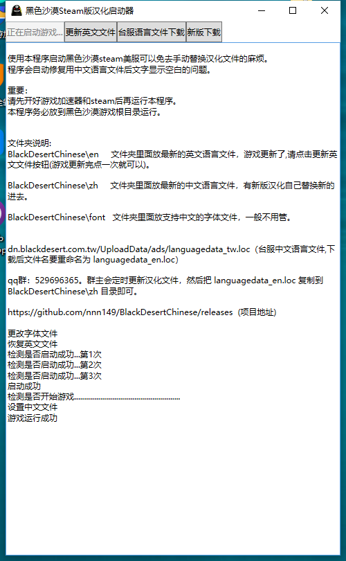

# BlackDesertChinese
黑色沙漠steam美服汉化工具

使用本程序启动黑色沙漠steam美服可以免去手动替换汉化文件的麻烦。
程序会自动修复用中文语言文件后文字显示空白的问题。

重要：
请先开好游戏加速器和steam后再运行本程序。
本程序务必放到黑色沙漠游戏根目录运行。

文件夹说明:
BlackDesertChinese\en     文件夹里面放最新的英文语言文件，游戏更新了,请点击更新英文文件按钮(游戏更新完点一次就可以)。

BlackDesertChinese\zh     文件夹里面放最新的中文语言文件，有新版汉化自己替换新的进去。

BlackDesertChinese\font   文件夹里面放支持中文的字体文件，一般不用管。

dn.blackdesert.com.tw/UploadData/ads/languagedata_tw.loc（台服中文语言文件,下载后文件名要重命名为 languagedata_en.loc）

qq群：1083325318。群主会定时更新汉化文件，然后把 languagedata_en.loc 复制到 BlackDesertChinese\zh 目录即可。

下载地址：
https://github.com/nnn149/BlackDesertChinese/releases  

蓝奏云下载：
https://nnn149.lanzous.com/b0dksb3wd
密码:h6u2

